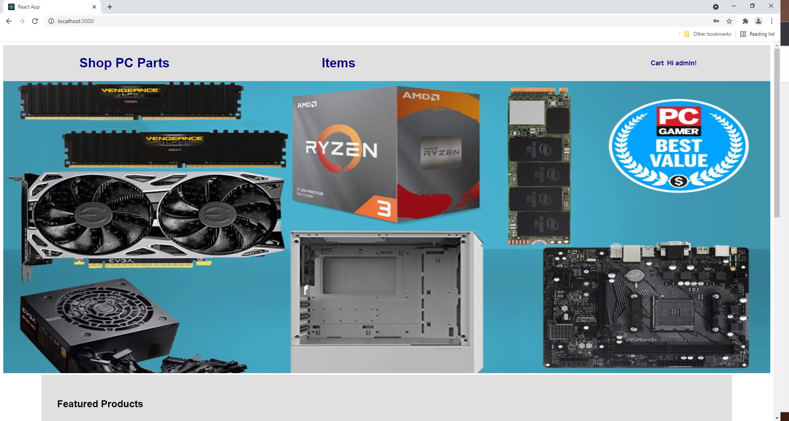
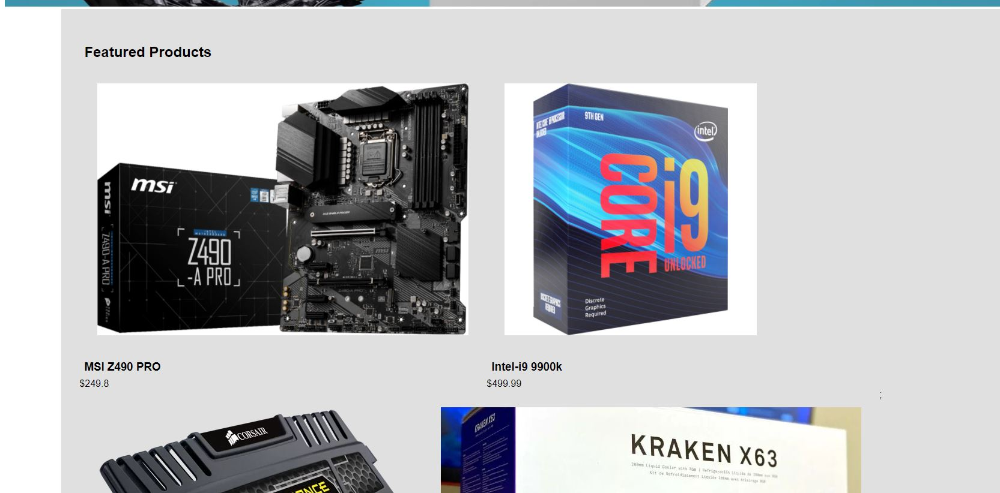
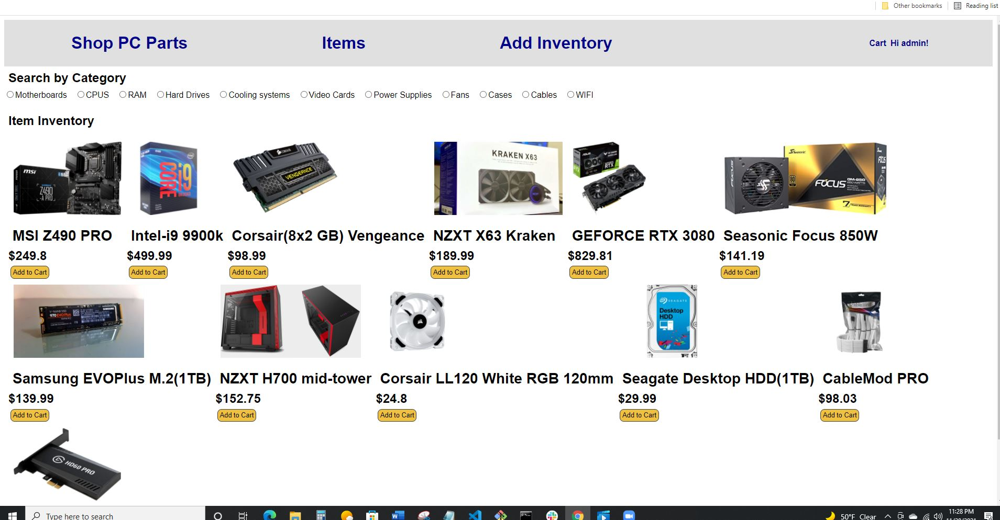
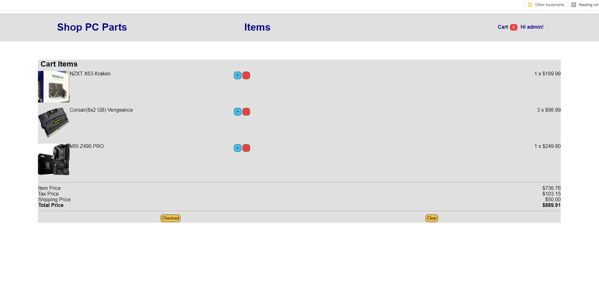

# SHOP_PC_PARTS
An online store for buying computer parts

## Description
SHOP_PC_PARTS is a simple store that demonstrates basic functionality of an online store. The user will be brought to the home page just 
as for any other website. There is a featured items page along with some options on the main header. The user can view the items inventory
by clicking items, and create an account by signing up. Once an account has been created, the user may login. One will notice that the items 
do not have the "add to cart" option if there is no user logged in. Only when one is logged in, can the user add items to the cart. The cart
link on the main header has a number increment that updates as the user adds items to the cart. One may visit the page by simply clicking on the
cart link given in the header. Once there, the total cost is shown for the order. You may either clear the cart, or proceed to checkout. As of 
right now, the checkout feature has not been implemented. Only the place holders for some information have been created. 

## Link to application

Click here - https://shop-pc-parts.herokuapp.com/

### Screenshots
# Homepage

# Featured Products

# Inventory

# Cart Page

